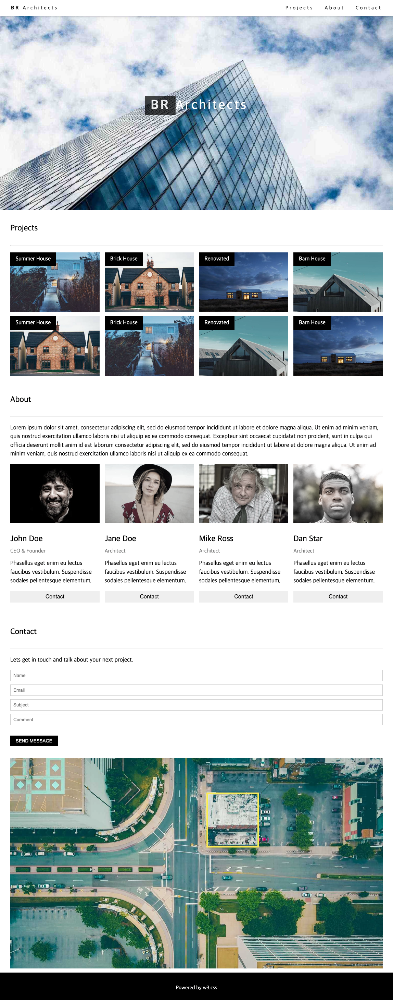
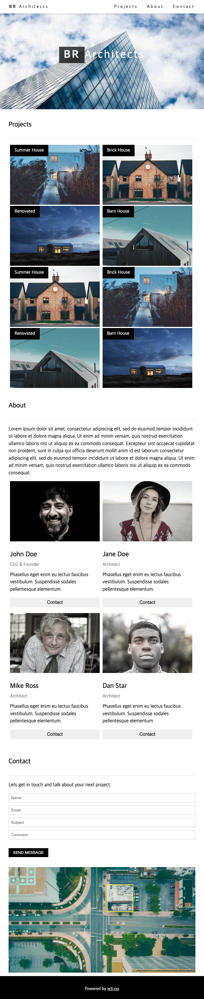
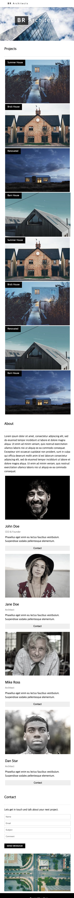

# CLONE PROJECT
* 리액트 학습을 위한 클론코딩
* 참조 사이트 https://www.w3schools.com/w3css/tryw3css_templates_architect.htm 

## 주요 학습내용
* GlobalStyles 설정
* flex 활용
* 미디어쿼리를 적용한 반응형 웹 구현

## 결과물
### Desktop

### Tablet

### Mobile

